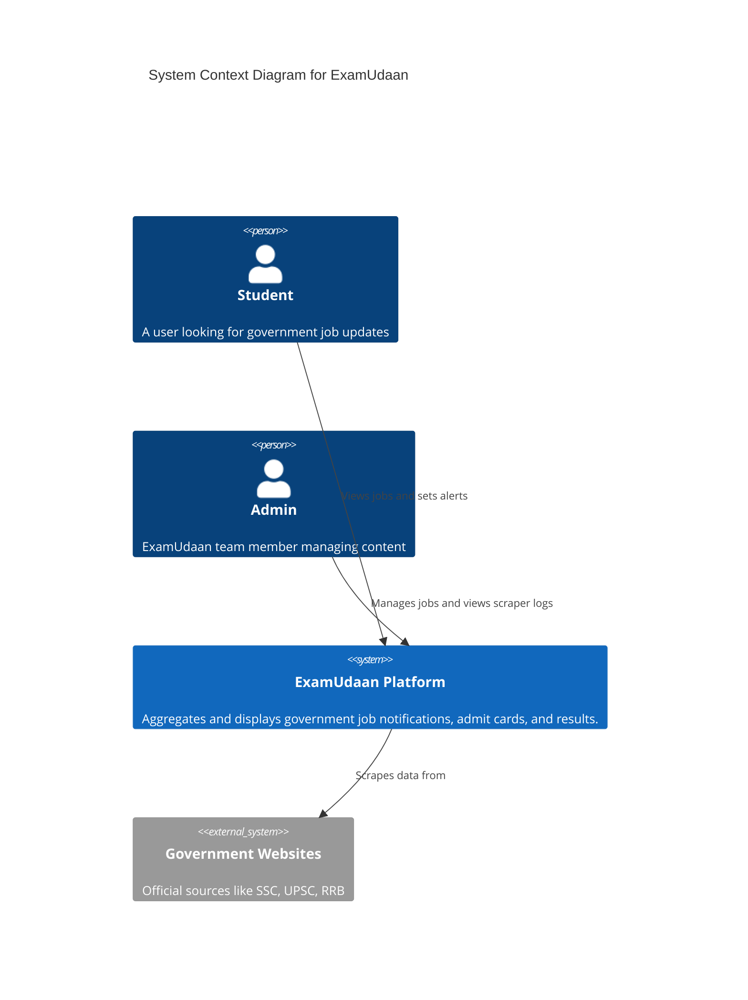
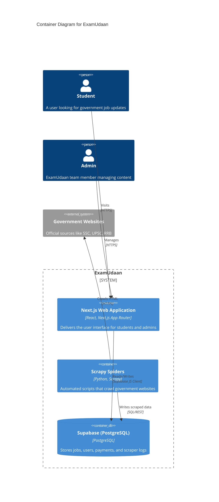
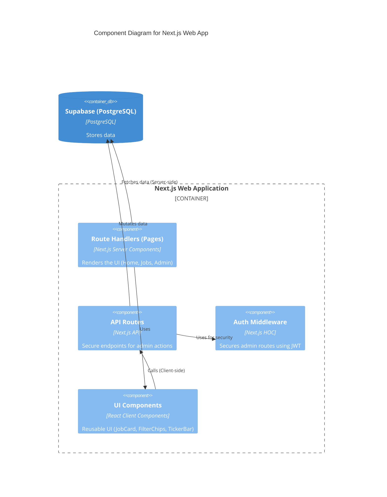

# Architecture: ExamUdaan C4 Model

## System Context (Level 1)
Shows how ExamUdaan fits into the world, interacting with users and external sources.

## Container Diagram (Level 2)
Shows the high-level technical containers that make up ExamUdaan.

## Component Diagram (Level 3) - Web App
Shows the internal components of the Next.js Web App.

